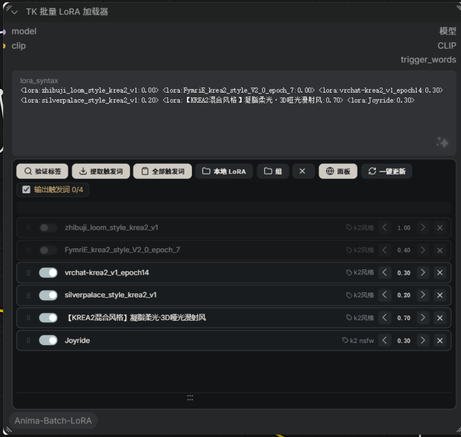
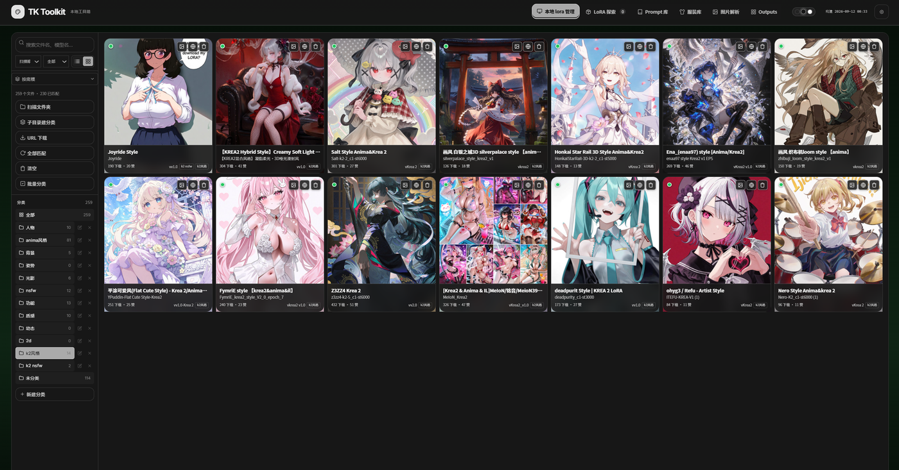
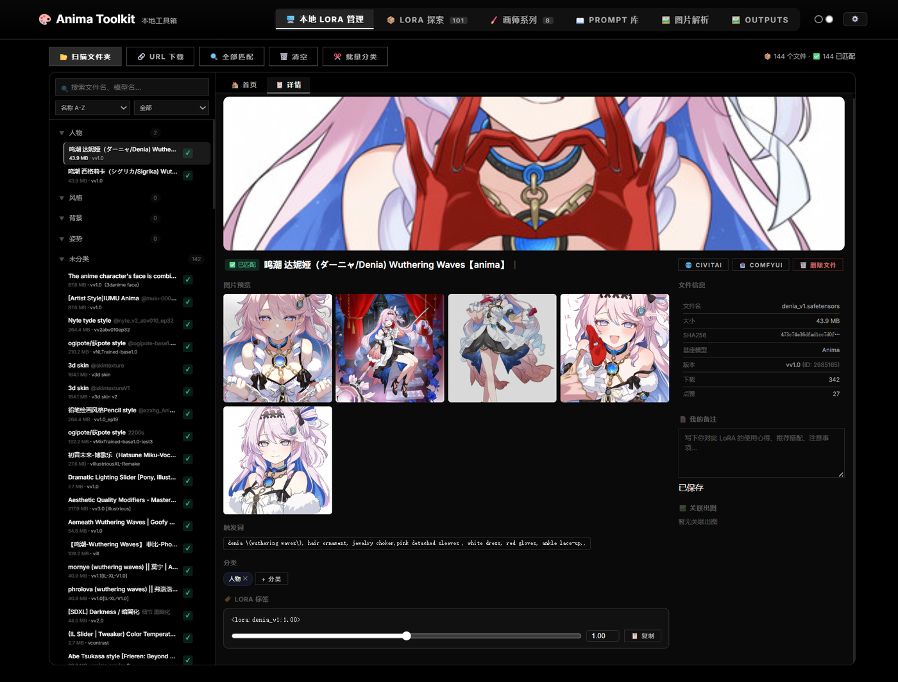
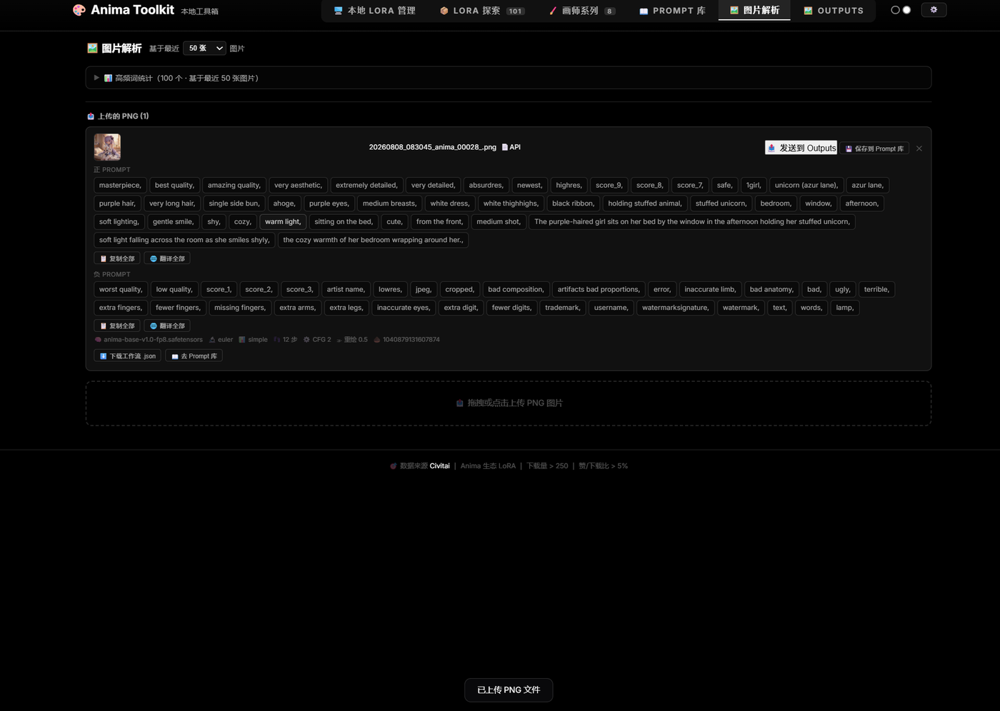
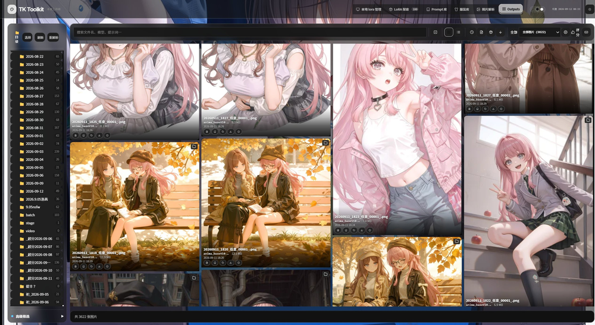
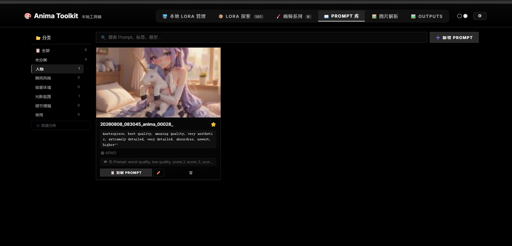
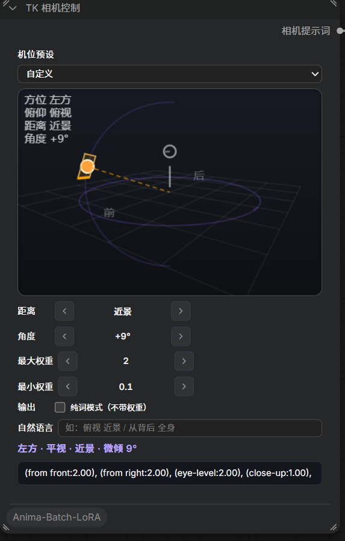
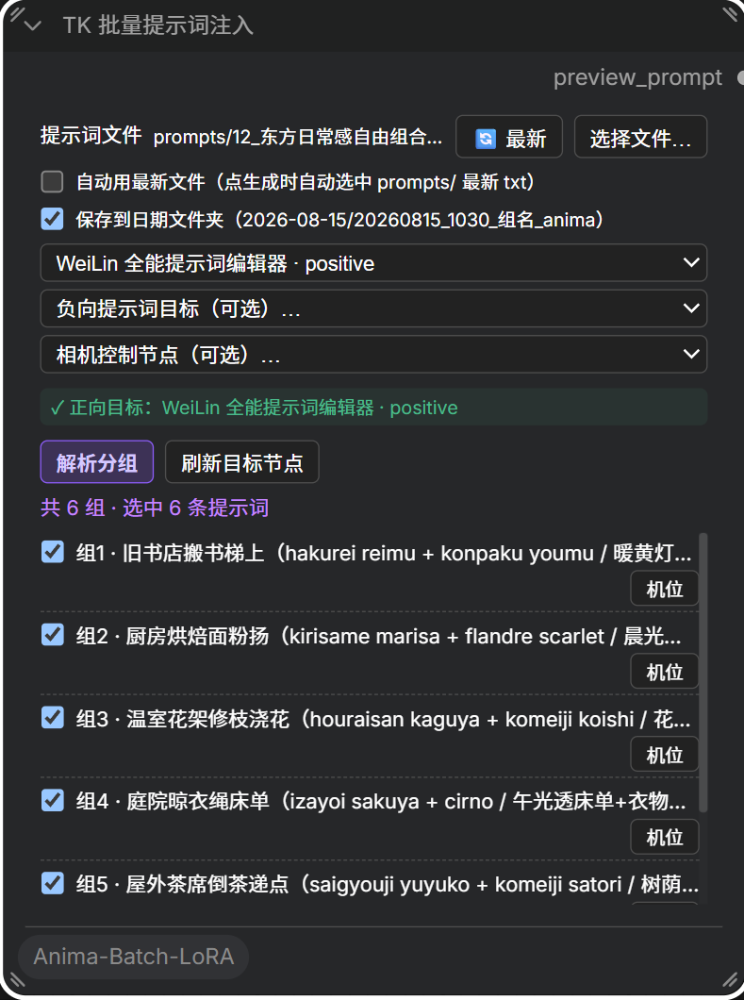
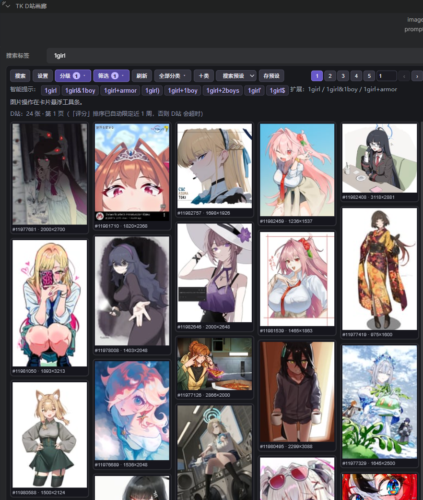
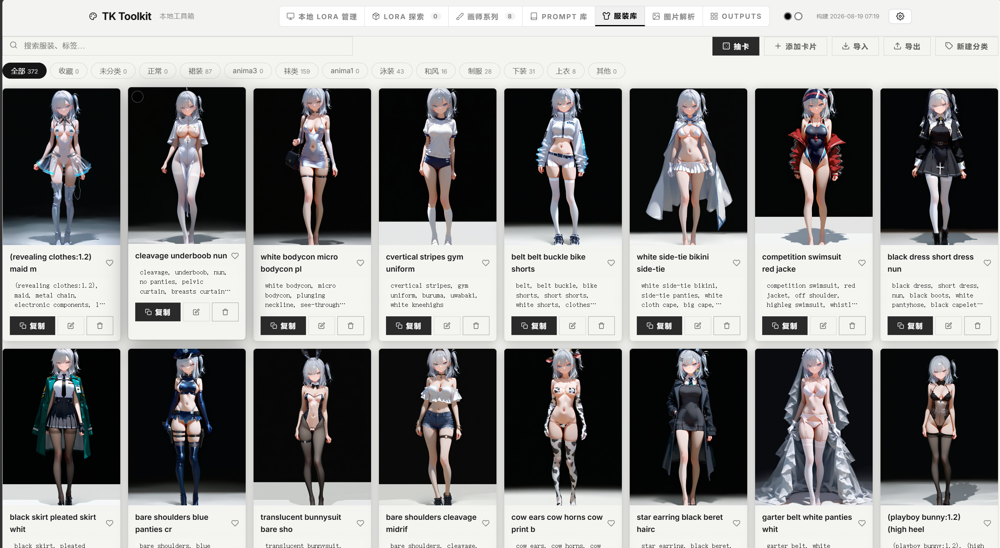

# Anima Toolkit · ComfyUI-Anima-Batch-LoRA

一个 ComfyUI 自定义节点 + 配套本地管理面板:批量挂 LoRA、可视化管理模型、解析返图参数、整理提示词。

## 功能总览

> 📖 每个模块的完整功能清单与操作细节见 **[功能详解文档](docs/FEATURES.md)**

### 1. LoRA 加载节点(Anima Batch LoRA Loader)



批量把 LoRA 挂到节点上,全程可视化操作:

- **直接粘贴标签即可读取**:把 `<lora:xxx:0.8>` 标签(触发词组合)复制粘贴进 `lora_syntax` 文本框,立刻解析成列表,不需要在面板里逐个挑选
- **一键复制触发词**:点 LoRA 名字即可复制它的触发词,方便写提示词
- **「本地 LoRA」可视化浏览窗**:看得到本地 LoRA 的 C 站预览图,点图就加入节点,支持分类、置顶、收藏
- **每个 LoRA 独立控制**:开关(关掉的不参与生成但保留在列表)、权重滑块、拖拽排序、删除
- **「验证标签」**:检查输入里的 LoRA 本地有没有,缺的可以一键复制名称去 C 站搜
- **「提取触发词 / 全部触发词」**:从当前标签里快速取用触发词
- **「组」**:把常用的 LoRA 组合存起来,一键切换
- **「面板」按钮**:直达本地管理面板

### 2. 本地 LoRA 管理(面板)

 · 

Steam 风格界面,管理全部本地 LoRA:

- **扫描 + 自动匹配 C 站信息**:文件大小、SHA256、基础模型、版本、下载数、点赞数自动对上
- **网格 / 列表视图 + 搜索 + 排序**(按名称、大小、时间)
- **分类管理**:人物 / 风格 / 背景 / 姿势 / 光影…支持拖拽归类、批量分类、自定义分类
- **详情面板**:文件信息、**「我的备注」**(写使用心得、推荐搭配)、触发词编辑、LoRA 强度滑块、分类标签
- **一键操作**:CIVITAI(打开 C 站原页)、COMFYUI(直接加入工作流)、复制标签、删除文件
- **「关联出图」**:看这个 LoRA 用过的返图,右下角一键跳进 Outputs

### 3. 图片解析(面板)



- **拖拽 / 点击上传**一张 ComfyUI 生成的原图 PNG
- 自动解析出:正面 prompt、负面 prompt、模型、采样器、步数、CFG、种子、工作流
- **一键复制** prompt、翻译、复制 LoRA 标签
- **「发送到 Outputs」**把图送进图片管理 / **「保存到 Prompt 库」**归档复用
- **「下载工作流 .json」**一键复现生成参数
- **高频词统计**:基于最近 N 张返图统计常用 tag,辅助写提示词

### 4. Outputs 图片管理(面板)



- 浏览 ComfyUI 输出目录,按日期 / 文件夹组织
- **收藏、置顶、打分、重命名、删除**、复制 prompt / LoRA 标签 / 工作流
- 拖拽框选批量操作 + 快捷键(全部/收藏/评分筛选)
- **目录选择、刷新、重解析、高级筛选**;搜索文件名/模型/提示词
- 点开任意图片查看元数据、下载工作流

### 5. Prompt 库(面板)



- 保存提示词,可带关联图片(从图片解析一键存进来)
- **分类管理**:人物 / 画师风格 / 背景环境 / 光影氛围 / 细节增强 / 常用 / 自定义
- 搜索、收藏、复制 PROMPT、编辑、删除

### 6. 画师系列(面板)

管理画师风格标签:
- 搜索画师名/Tag/描述;工具栏:+ 添加、提取、默认、批量、导入、导出、**DANBOORU 更新**(从 Danbooru 同步)
- **NAI / WebUI 画师串**:点卡片组合 → 复制 / 粘贴画师串一键导入 / 解析导入
- **保存预设 / 我的预设**:常用组合一键复用

### 7. LoRA 探索(面板)

浏览 C 站 LoRA(Anima 生态,下载量 > 250、赞/下载比 > 5%):

- **多维筛选**:下载量排序、模型类型、时间范围(全部/本月/本周)、搜索名称/描述/标签/作者
- **抓取全部 / 自动翻页**批量加载、**选择**多选模式、**手动添加**(URL 添加)
- 分类 tab:全部 / 画师风格 / 人物角色 / 美学优化 / 背景环境 / 其他 / 收藏 / 已隐藏
- 检测本地是否已有,卡片上直接下载

### 8. TK 节点系列(九个配合作画节点)

 ·  · 

九个配合作画的新节点(批量 LoRA 加载器见上面第 1 节):

- **TK 相机控制**:3D 画布上直接拖拽机位(**相对滑动,可连续绕到背面/俯仰),景别(距离)、翻滚、最大/最小权重;支持 19 个预设,一键出相机词并联动批量提示词节点
- **TK 批量提示词注入**:读取 `input/prompts/` 提示词文件按组批量出图(**一组 = 一张图**);支持每页一组独立机位(`相机:` 行)、子目录分组、整批统一机位
  - **批任务控制器(2026-08-24)**:批量由服务端逐条链式执行(不再依赖浏览器劫持队列),每条任务有稳定状态(排队/执行/成功/失败/跳过/中断)与自铸造 `prompt_id` 精确追踪;节点面板实时显示进度,**支持暂停 / 继续 / 失败重试 / 跳过单条 / 取消**,绿对号直接看到每组产物文件名;批次清单持久化在 `data/batches/`,**刷新页面或重启 ComfyUI 后可在节点上恢复未完成批次**并重跑中断任务;点 ComfyUI 的 Queue 按钮或节点「▶ 开始批次」均可发起
- **TK D站画廊**:按标签搜索 Danbooru(Novelu&Danbooru 图库)图片,多选输出 IMAGE + Prompt + **metadata_json(结构化元数据:Danbooru ID / 原始标签数组 / Prompt 分组 / 输出设置 / rating / score / 收藏数 / 尺寸 / 文件类型 / 视频标记 / 原图 URL / 失败原因)**,下游可直接筛选与复现;内置分级/时间/评分/收藏筛选、Prompt 类别/格式控制、双语 tag 预览、下载、入 Prompt 库
  - **D站风控自救**:当 Danbooru 的 Cloudflare 把出口节点 IP 拦成「Just a moment」人机校验页时(表现为搜索失败/一直转圈/请求超时),节点会自动隐形式拉起本机 **Edge/Chrome 作为内置浏览器网关**继续搜索与下载,无需手动换节点;偶发仍被拦请到 Clash Verge 换一个节点/地区。
  - **依赖**:云风控自救需 ComfyUI 的 Python 环境装有 `playwright`(`pip install playwright`);未装时自动降级为直接请求并给出提示。
  - **模糊搜索 + 回车直搜**:搜索不必完全匹配标签——输入近似词/拼写错误(如 `standin`)精确搜不到时会自动纠错成真实标签(如 `standing`)并重搜出图,搜索框同步更新为正确标签;搜索框直接按 **回车** 即可搜索,无需点「搜索」按钮。
- **TK 批量 LoRA 加载器**:见第 1 节——批量挂 LoRA、触发词/全部触发词一键复制、本地 LoRA 可视化浏览、权重滑块、分组保存
- **TK 图像选择**:多路图像路由(image1~image8,**用几路接几路 2~8 任意**;未接的自动跳过、至少一路有效)。**五种路由模式**:优先顺序(默认,首选为空自动按 image1→image8 兜底)/ 指定索引 / 随机 / Seed 稳定(同 seed 可复现) / 轮询(循环换源);另输出 **source_index(来源编号 1~8)+ source_name(imageN)**,下游可精确知道图源。典型场景:D站画廊图源接 image1、自定义图源接 image2/3…,生图来源一键切换,不必改连线;输出恒为列表,兼容 D站画廊列表输出与下游单输入节点
- **TK Prompt Cards**(提示词卡片库编辑器):英中对照 tag 卡片拼/存提示词、②区中文片段选择翻译源并校准为 Danbooru 规范标签（支持单条翻译/自然语言语义解析；自动回退含本地 Argos，DeepLX 按需启动）、批文件一键切换、工具箱 Prompt 库条目双击弹窗编辑保存、①区库面板高度可拖拽调整、可选 CLIP 直接编码输出 CONDITIONING、`lora_syntax` 直连批量 LoRA 节点、LLM 自动分类、PNG 解析、导出批词文件
- **TK Trigger Words**(触发词):从 `<lora:name:weight>` 提取触发词(bridge 触发词优先,无记录时文件名兜底),支持手动追加、卡片编辑、一键复制
- **TK Text Join**(文本合并):按逗号/空格/换行合并 4 路文本,自动清理连续逗号
- **TK 空Latent**(预设空 Latent):Anima/Cosmos 5D 单帧空 latent,常用尺寸预设

### 9. 服装库(面板)



- 服装卡片库,平铺分类(裙装/泳装/制服/袜类…)自定义分组
- **AI 抽卡**:随机抽 N 套服装串复制合并,写词即"已抽卡"
- 导入(合并不删旧卡)/导出,支持逐张勾选预览
- 任何增删改自动同步 AI 检索索引,写词时自动按分类可用

## TK 批量提示词节点 + 配套 AI 撰写 skill


**TK Prompt Batch(批量提示词注入)** 读本地提示词文件按组批量出图:一组 = 一张图,批量由**服务端批任务控制器**按组顺序执行(一组跑完才入队下一组),不依赖浏览器常驻。提示词文件放 ComfyUI 的 `input/prompts/` 目录,格式:

```txt
## 组1 · 单人日常 · 教室窗前
masterpiece, best quality, score_9, year 2025, highres, safe, 1girl, [角色], [系列], [通用标签...]
相机: from the side, low angle        # 可选:该组的机位

## 组2 · 双人 · 海边黄昏
masterpiece, best quality, score_9, year 2025, highres, safe, 2girls, [角色A], [角色B], [系列], [通用标签...]
```

- 标题行支持 `## 组N · 标题` / `【N】标题` / `01 序号` 三种;`#` 开头是注释;组内可写 `相机:` 行(不计入提示词)。
- 节点上点「选择文件…」或「🔄 最新」即可加载;勾选「自动用最新文件」后每次队列自动用最新 txt。

**让 AI 帮你写这种文件**:仓库自带配套 skill [`skill/anima-prompt-writer/SKILL.md`](skill/anima-prompt-writer/SKILL.md)(标准正向撰写,SFW 安全版)。它按固定标签顺序(质量→美学→时代→meta→安全→人数→角色→系列→画师@→通用)+ 一段空间构图句写正片,并自动落到 `input/prompts/` 的正确目录与格式——没有数据集,以规则为唯一标准。

安装:把 `skill/anima-prompt-writer` 目录复制到你所用 AI 的 skills 目录(如 Claude Code 的 `~/.claude/skills/` 或 DSH 的 `~/.dsh/skills/`),之后让 AI「写提示词」即可。

## 部署

把仓库克隆到 ComfyUI 的 custom_nodes 目录:

```bash
cd ComfyUI/custom_nodes
git clone https://github.com/Ararararararaki/comfyui-anima-toolkit.git
```

然后重启 ComfyUI。app 目录已经预先构建好,不用装依赖也不用重新构建,克隆完就能用。

## 开发者:从源码重建面板

app 目录是构建产物,日常使用不用管它。改面板源码后需要重建:

```bash
cd panel
npm install
npm run build:comfyui   # 类型检查 → 打包 → 部署到 ../app
```

开发模式用 `cd panel && npm run dev`(Vite 热更新,接口代理到本地 ComfyUI)。推送到 panel 目录的改动由 GitHub Actions 自动重建 app。

## 目录结构

```
ComfyUI-Anima-Batch-LoRA/
├── __init__.py           # 后端接口（/anima/*，存元数据）
├── anima_batch_lora.py   # 节点逻辑
├── web/js/               # 节点前端（不用构建）
├── app/                  # 面板构建产物（克隆即用，别手改）
├── panel/                # 面板源码（Vite + TypeScript）
├── skill/                # 配套 AI skill（anima-prompt-writer 标准正向撰写）
├── screenshots/          # 截图
└── .github/workflows/    # 自动构建 app
```

## 依赖

- ComfyUI(2024 年之后的版本)
- 只有重建面板时才需要 Node 18+

觉得好用的话点个 star 支持一下,后续还会继续优化。
