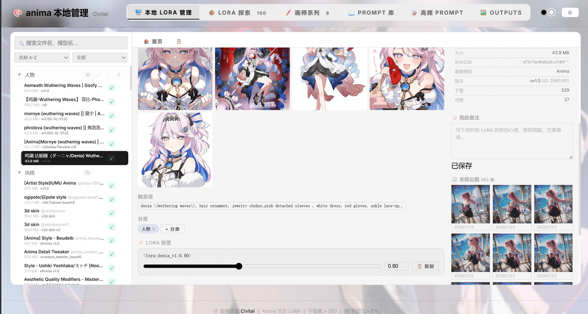
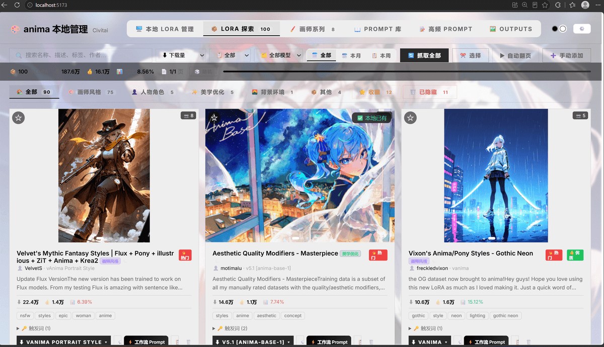
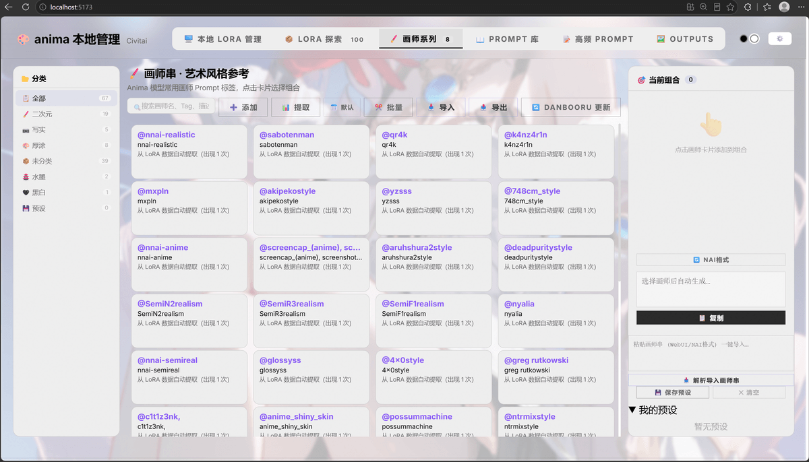
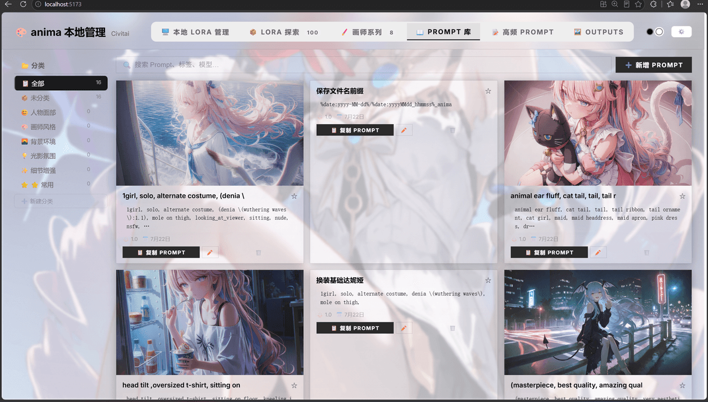
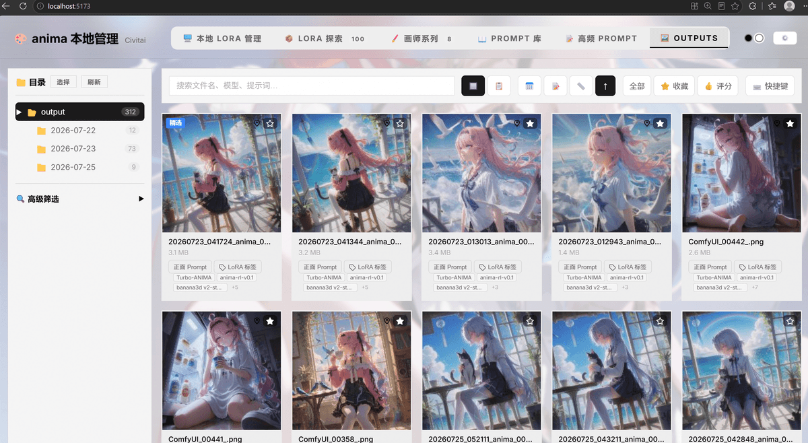
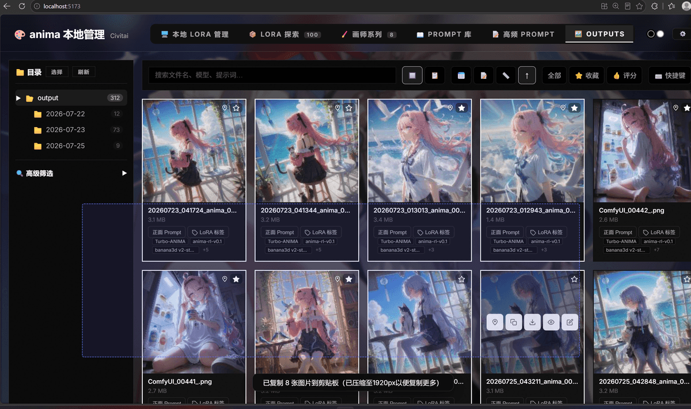
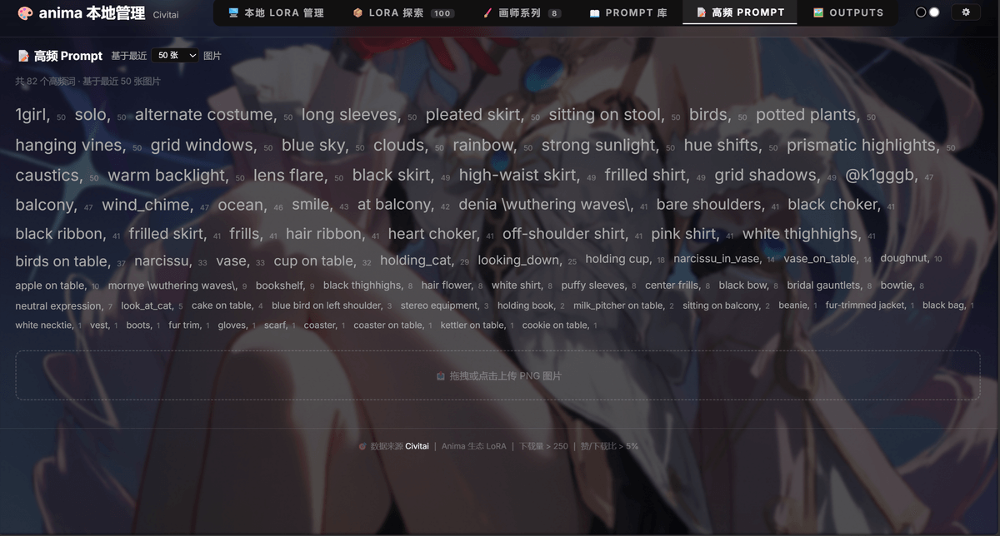
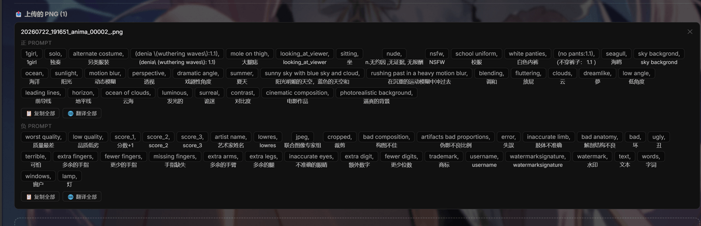

# Anima Toolkit · ComfyUI-Anima-Batch-LoRA

**Anima Toolkit**：ComfyUI 自定义节点（批量 LoRA 加载器）+ 内嵌本地管理面板，clone 即用、无需构建。

浏览、搜索和收藏 Civitai 上的 Anima LoRA 模型，支持本地文件管理、画师系列、Prompt 库、Outputs 元数据解析。

## ✨ 功能一览

### 🖼️ 本地 LoRA 管理

扫描本地 LoRA 文件，Civitai 自动匹配，权重调节，一键复制标签，首页可读取 Outputs 图片的常用 LoRA，可点击跳转。


LoRA 详细页可看到 C 站预览图、本地文件名、版本号等数据，支持备注，以及查看从 Outputs 中的返图，可点击直接跳转。




### 📦 LoRA 探索

浏览 Civitai Anima 生态 LoRA，按下载量/点赞/分类筛选，可检测本地是否已有，可切换版本号，可直接在页面下载。



### 🖌️ 画师系列

画师风格标签管理与组合，Danbooru 数据集成。



### 📖 Prompt 库

分类管理提示词，提取 LoRA 触发词。



### 🖼️ Outputs 管理

ComfyUI 输出目录浏览，元数据提取，批量操作。可从图片直接复制正面 Prompt / LoRA 标签 / 工作流，点「元数据」查看完整信息。



支持拖拽框选批量操作。



快捷键。


### 📝 高频 Prompt

从 Outputs 最近的图片中提取高频词，可点击复制。



### 🔄 PNG 元数据导入

上传带元数据的 PNG 获取 Prompt，可翻译（ComfyUI 生成的图一般带元数据）。



> 本项目的本地 LoRA 管理参考了 [hanbinhsh/SD-LoRA-Manager](https://github.com/hanbinhsh/SD-LoRA-Manager) 的设计，感谢大佬。

## ⚙️ Anima Batch LoRA Loader 节点

- 支持 `<lora:name:weight>` 批量语法，一次加载多个 LoRA
- 可视化编辑器：权重滑块、拖拽排序、触发词提取/复制
- 分类 / 收藏 / 置顶（元数据存插件目录 `anima_meta.json`，重启不丢）
- 本地 LoRA 浏览弹窗：**列表 / 网格**切换、**虚拟滚动**、**拖拽框选批量添加分类**、C 站预览图懒加载、搜索排序

## 📦 安装（一键）

```bash
cd ComfyUI/custom_nodes
git clone https://github.com/Ararararararaki/comfyui-anima-toolkit.git
```

然后**重启 ComfyUI**。

> 💡 面板使用**相对路径**加载资源，clone 后**目录名可任意**。`app/` 已预构建，**无需 npm install / 构建**。

## 🚀 使用

- **节点**：ComfyUI 中搜索 `Anima Batch LoRA Loader`，粘贴 `<lora:name:weight>` 标签或点「📂 本地」从列表添加
- **面板**：**无需单独启动**——由 ComfyUI 直接提供。点菜单栏「🎨 Anima」或节点工具栏「🌐 面板」按钮打开；或访问 `http://localhost:8188/extensions/<目录名>/app/`
- **首次使用**：在「本地 lora 管理」/「Outputs」选择一次目录（浏览器文件访问授权 + 扫描），数据保存在浏览器本域

## 🛠️ 从源码重建面板（开发者）

`app/` 是已构建产物，日常使用无需构建。修改面板源码后重建：

```bash
cd panel
npm install
npm run build:comfyui   # 类型检查 → vite build → 部署到 ../app
```

- **开发模式**：`cd panel && npm run dev`（Vite 热更新，API 代理到 `http://localhost:8188`）
- **CI 自动构建**：push 到 `panel/` 的改动会由 GitHub Actions 自动重建并提交 `app/`

## 📁 目录结构

```
ComfyUI-Anima-Batch-LoRA/
├── __init__.py           # 后端路由（/anima/* API、元数据持久化）
├── anima_batch_lora.py   # 节点逻辑 + LoRA 列表/桥接 API
├── web/js/               # 节点前端 widget（无需构建）
├── app/                  # 面板构建产物（clone 即用，勿手改）
├── panel/                # 面板源码（Vite + TypeScript）
├── screenshots/          # README 截图
└── .github/workflows/    # 自动构建 app/ 的 CI
```

## 依赖

- ComfyUI（2024 之后版本，含 `folder_paths`、`PromptServer`）
- 面板构建仅需 Node 18+（仅开发/重建时需要）

## License

MIT
