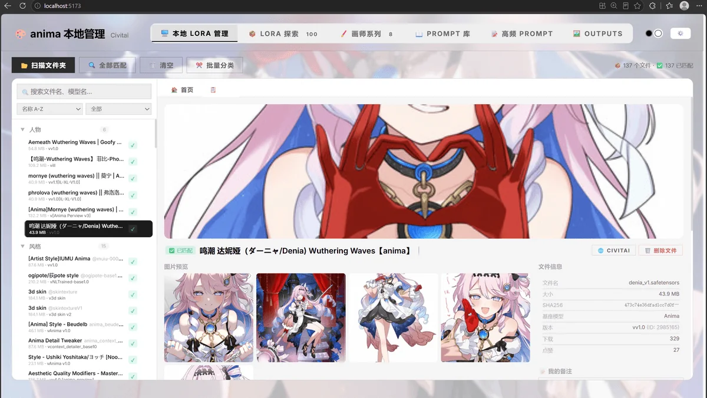
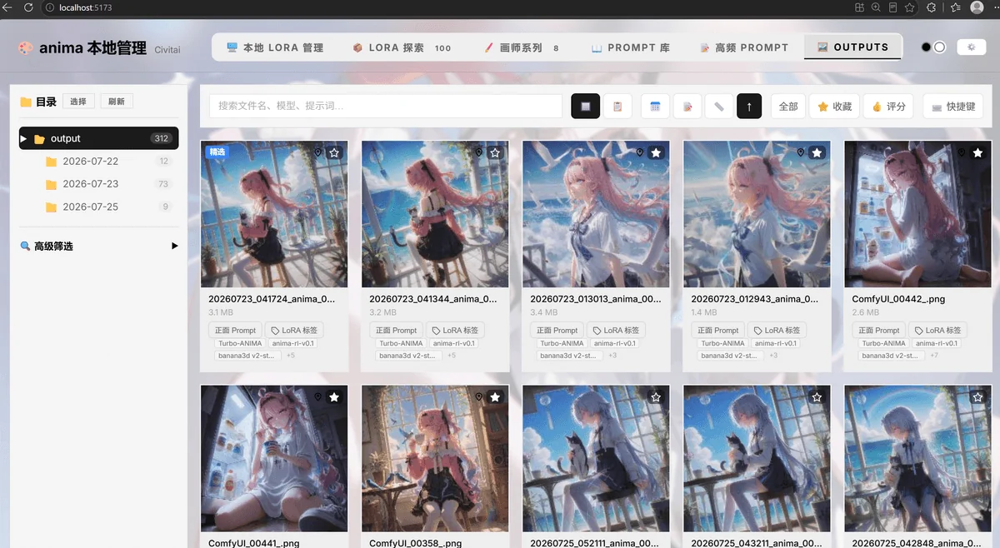
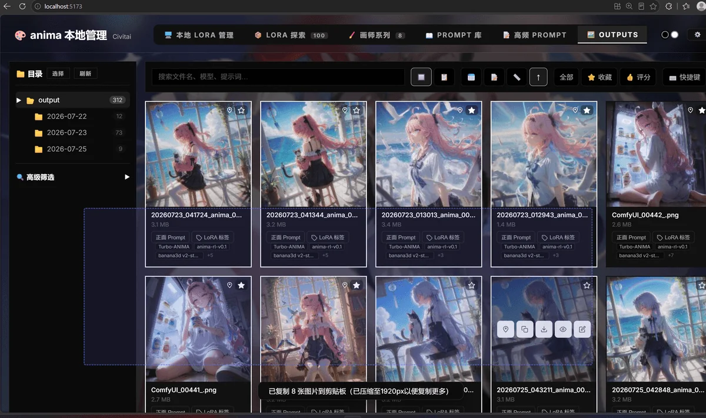
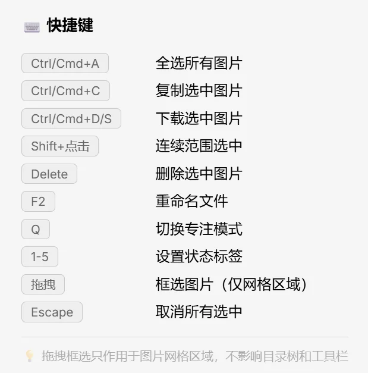
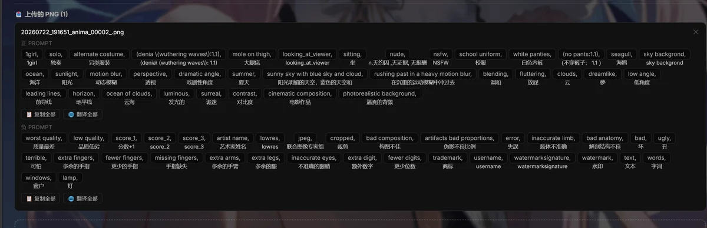
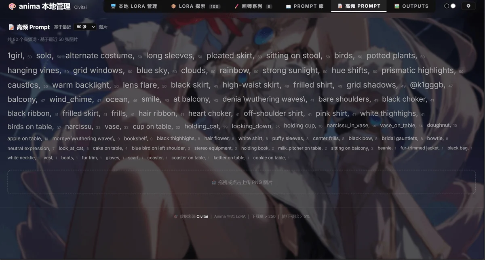
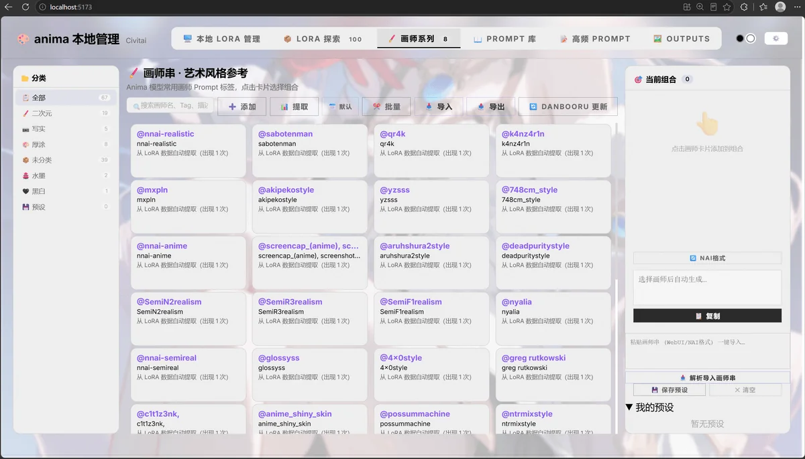

# Anima Toolkit · ComfyUI-Anima-Batch-LoRA

**Anima Toolkit**：ComfyUI 自定义节点（批量 LoRA 加载器）+ 内嵌本地管理面板，clone 即用、无需构建。

浏览、搜索和收藏 Civitai 上的 Anima LoRA 模型，支持本地文件管理、画师系列、Prompt 库、Outputs 元数据解析。

## ✨ 功能一览

### 🔧 LORA 加载节点

- 支持 `<lora:name:weight>` 批量语法，一次加载多个 LoRA
- 点击 lora 名可直接**复制触发词**
- 点「📂 本地」按钮：通过预览本地 LoRA 的 **C 站预览图**直观添加，可点击加入节点，可分类、置顶等操作
- 点「🌐 面板」按钮进入**功能强大的本地管理页面**



### 🖥️ 本地 LoRA 管理

参考 [hanbinhsh/SD-LoRA-Manager](https://github.com/hanbinhsh/SD-LoRA-Manager) 的设计，类似 Steam 的 UI 界面。

- 扫描本地 LoRA 文件，Civitai 自动匹配，权重调节，一键复制标签
- 首页可读取 Outputs 图片的常用 LoRA，可点击跳转
- 可预览**多张 C 站图片**，从 Outputs 中关联 LoRA 进行**返图**，点击复制触发词 / LoRA 标签
- 右键分类 / 添加分类，收藏 / 置顶


### 🖼️ Outputs 管理

- 从本地图片快速进行**收藏、置顶、复制 prompt / lora 标签 / 工作流 / 元数据**等操作
- 可进行拖拽批量选取，通过快捷键批量复制下载（选区多张时汇总为压缩包）
- 点「元数据」查看完整信息








### 📝 图片 Prompt 解析

- 从带有元数据的图片（ComfyUI 生成的原图）拖拽或上传，获取正负面 prompt、工作流
- 可一键翻译全部，可对单个提示词点击复制
- 可一键将图片提取的 prompt 发送到 Prompt 库 —— 1 秒抄走群友的作业
- 可从 Outputs 提取最近 20/50/100 张生成图片的**高频词**，可点击复制





### 📖 Prompt 库

分类管理提示词，提取 LoRA 触发词。

### 🖌️ 画师系列（待优化）

- 画师串管理，可分类，可组合多个画师提示词一键复制
- 可从本地 LoRA 的触发词提取到画师串



### 📦 LoRA 探索（待优化）

- 浏览 Civitai Anima 生态 LoRA，按下载量 / 点赞 / 分类筛选
- 可手动通过 URL 添加、分类、检测本地是否已有
- 卡片点击版本可直接下载


> ⚠️ 已知问题：Outputs 复制 LoRA 标签功能待修复。

## 📦 安装（一键）

```bash
cd ComfyUI/custom_nodes
git clone https://github.com/Ararararararaki/comfyui-anima-toolkit.git
```

然后**重启 ComfyUI**。

> 💡 面板使用**相对路径**加载资源，clone 后**目录名可任意**。`app/` 已预构建，**无需 npm install / 构建**，clone 即用。

## 🚀 使用

- **节点**：ComfyUI 中搜索 `Anima Batch LoRA Loader`，粘贴 `<lora:name:weight>` 标签或点「📂 本地」从列表添加
- **面板**：**无需单独启动**——由 ComfyUI 直接提供。点顶部菜单或节点工具栏「🌐 面板」按钮打开；或访问 `http://localhost:8188/extensions/<目录名>/app/`
- **首次使用**：在「本地 lora 管理」/「Outputs」选择一次目录（浏览器文件访问授权 + 扫描），数据保存在浏览器本域

## 🛠️ 从源码重建面板（开发者）

`app/` 是已构建产物，日常使用**无需构建**。修改面板源码后重建：

```bash
cd panel
npm install
npm run build:comfyui   # 类型检查 → vite build → 部署到 ../app
```

- **开发模式**：`cd panel && npm run dev`（Vite 热更新，API 代理到 `http://localhost:8188`）
- **CI 自动构建**：push 到 `panel/` 的改动会由 GitHub Actions 自动重建并提交 `app/`

## 📁 目录结构

```
ComfyUI-Anima-Batch-LoRA/
├── __init__.py           # 后端路由（/anima/* API、元数据持久化）
├── anima_batch_lora.py   # 节点逻辑 + LoRA 列表/桥接 API
├── web/js/               # 节点前端 widget（无需构建）
├── app/                  # 面板构建产物（clone 即用，勿手改）
├── panel/                # 面板源码（Vite + TypeScript）
├── screenshots/          # README 截图
└── .github/workflows/    # 自动构建 app/ 的 CI
```

## 支持

觉得好用点个 star 谢谢喵～ 后续也会持续优化（可能还会做 CLIP 节点，不过现在有 weilin 大佬在，还轮不到我）。

## 依赖

- ComfyUI（2024 之后版本，含 `folder_paths`、`PromptServer`）
- 面板构建仅需 Node 18+（仅开发 / 重建时需要）

## License

MIT
