# Anima Toolkit · ComfyUI-Anima-Batch-LoRA

本项目旨在解决 ComfyUI 在各种情况下使用的便利，集成了以下功能：

## 🔧 LORA 加载节点

- 可直接点击 lora 名复制触发词
- 可从节点的「📂 本地」按钮，通过预览本地的 lora 的 C 站预览图直观地对 lora 进行添加，可点击加入节点，可对 lora 分类、置顶等操作
- 点击「🌐 面板」按钮进入功能强大的本地管理页面

## ꧁༺ 本地管理页面 ༻꧂

### 🖼️ Outputs 管理

- 从本地图片快速进行收藏、置顶、复制 prompt、lora 标签、工作流等功能

### 📝 图片 Prompt 解析

- 从带有元数据的图片（由 ComfyUI 生成的原图）拖拽或从本地上传，获取正负面 prompt、工作流
- prompt 可直接点击全部翻译按钮进行翻译，可对单个提示词点击复制
- 可一键将图片提取出的 prompt 发送到 prompt 库 —— 1 秒抄走群友的作业
- 可从 outputs 提取出最近 20/50/100 张生成图片的高频出现词，可点击复制

### 📖 Prompt 库

- 普通的存储 prompt 的模块，可以分类

### 🖥️ 本地 LORA 管理

- 参考了 [hanbinhsh/SD-LoRA-Manager](https://github.com/hanbinhsh/SD-LoRA-Manager) 大佬的设计
- 类似于 Steam 的 UI 界面
- 可预览多张 C 站图片，从 outputs 中关联 lora 进行返图，点击复制触发词、点击复制 lora 标签等功能

### 🖌️ 画师系列（待优化）

- 普通的画师串管理，可以分类，可以点击多个画师提示词组成画师串，然后点击进行复制
- 可从本地 lora 中的触发词提取到画师串

### 📦 LoRA 探索（待优化）

- 普通的探索 C 站中的 lora，可手动通过 URL 添加，进行分类，检测本地是否已有，可以在卡片点击版本直接进行下载

觉得好用点个 star 谢谢喵～ 后续也会进行优化的，以及可能后续会做 CLIP 节点，不过现在有 weilin 大佬在，还轮不到我（

## 📦 部署方式

直接 git clone 到 ComfyUI 的 `custom_nodes` 文件目录下就可以了喵

```bash
cd ComfyUI/custom_nodes
git clone https://github.com/Ararararararaki/comfyui-anima-toolkit.git
```

然后**重启 ComfyUI**。`app/` 已预构建，**无需 npm install / 构建**，clone 即用。

**打开面板**：重启后，ComfyUI 页面顶部右侧会出现「本地工具箱」图片按钮，点击即可进入本地管理面板（无需从节点进入）；也可以从节点的「🌐 面板」按钮打开。

## 具体展示

### LORA 加载节点：

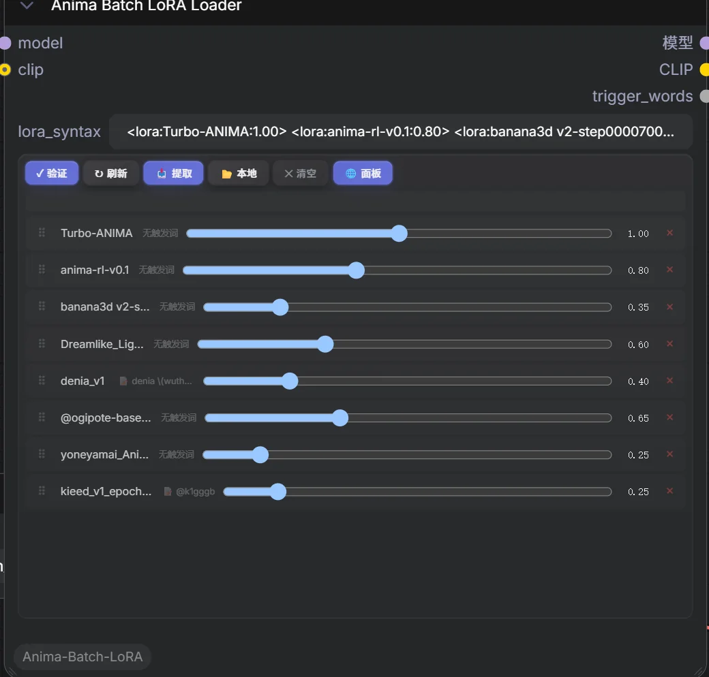

### 触发词复制：

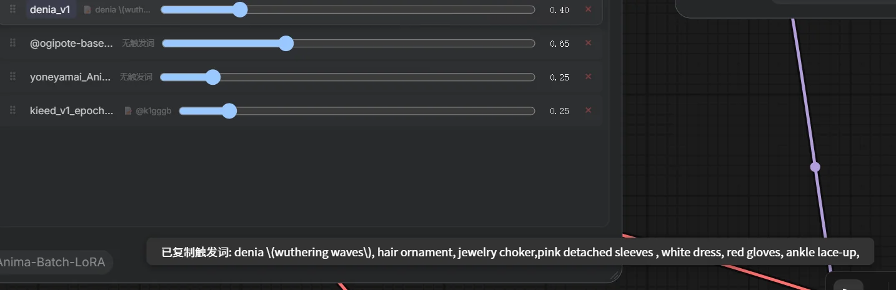

### lora 选区页面：

网格 UI

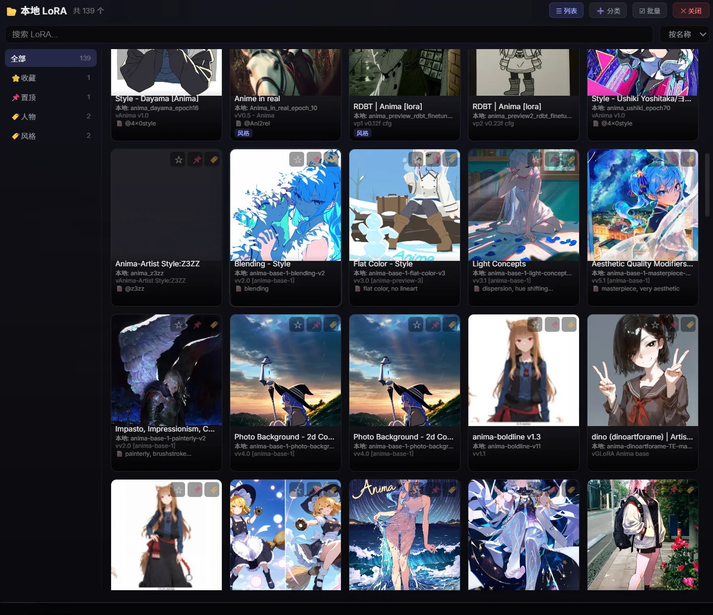

列表 UI

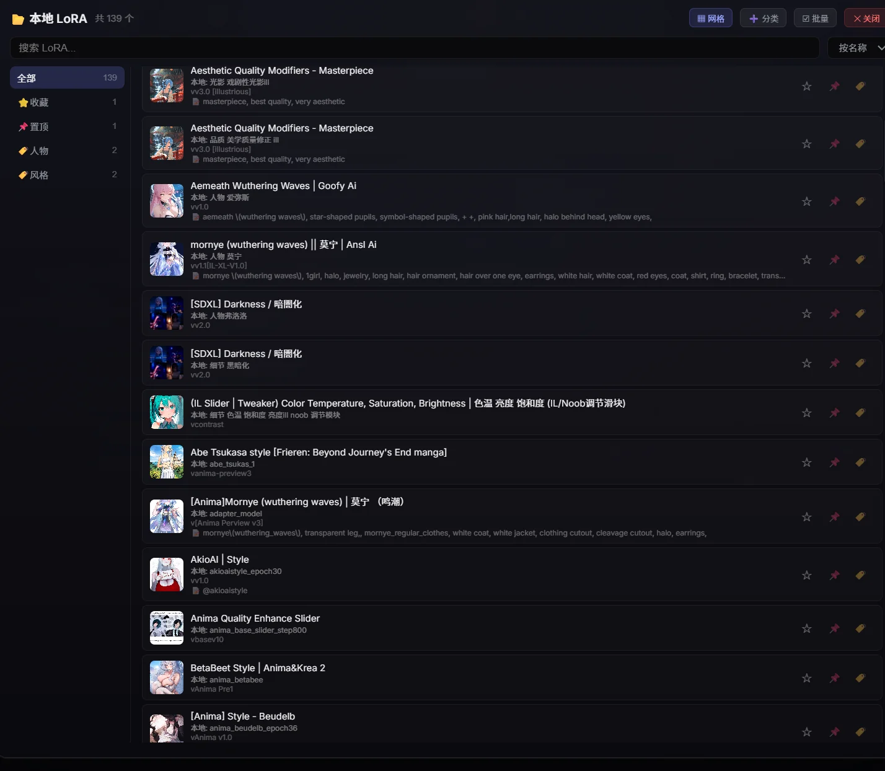

拖拽框选批量分类（不会添加到节点）

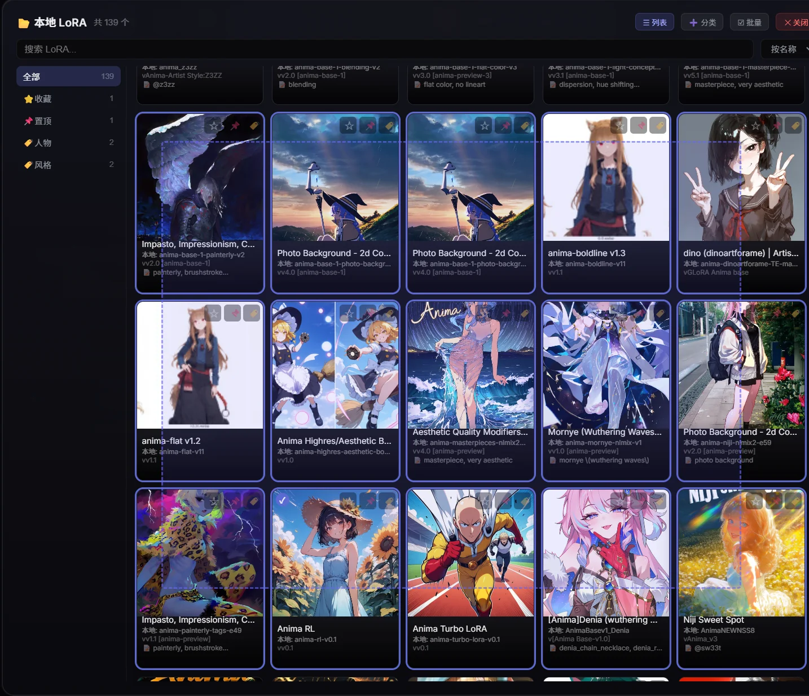

单点 lora 添加到节点，再次点击移除

### 本地 LORA 管理

扫描本地 LoRA 文件，Civitai 自动匹配，权重调节，一键复制标签，首页可读取 outputs 图片的常用 lora，可点击跳转

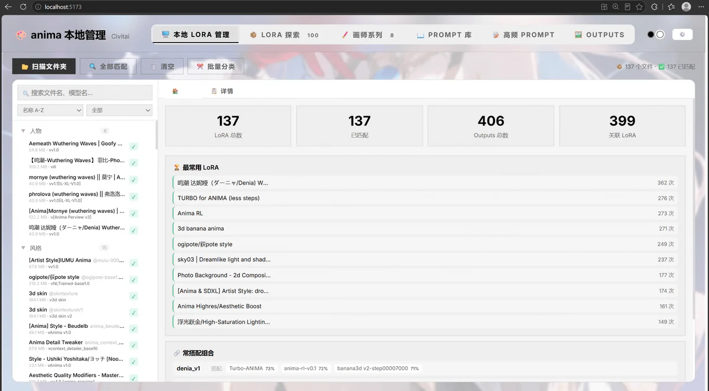

在 lora 详细页面可以看到 c 站的预览图以及本地文件名、版本号等数据，可以进行备注以及查看从 outputs 中的返图，可以点击直接跳转到 outputs 的对应图片位置

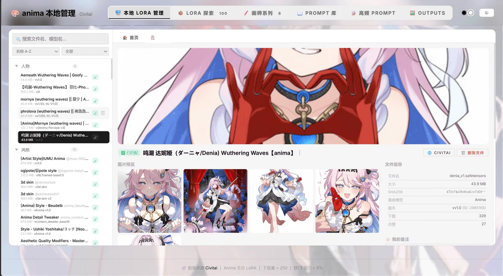


可以右键进行分类且添加分类

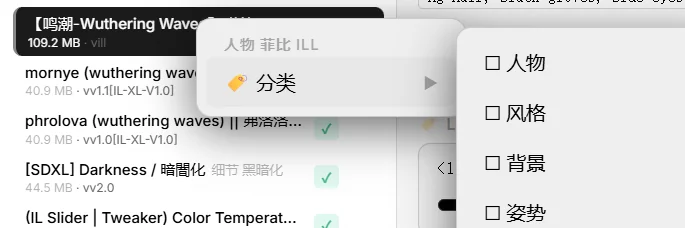

或从  点击加号进行添加分类

### 画师系列

画师风格标签管理与组合，Danbooru 数据集成，可保存预设

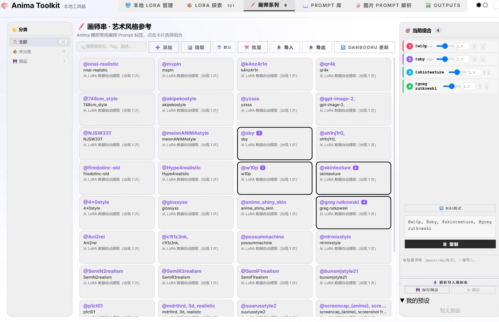

### Prompt 库

分类管理提示词，提取 LoRA 触发词

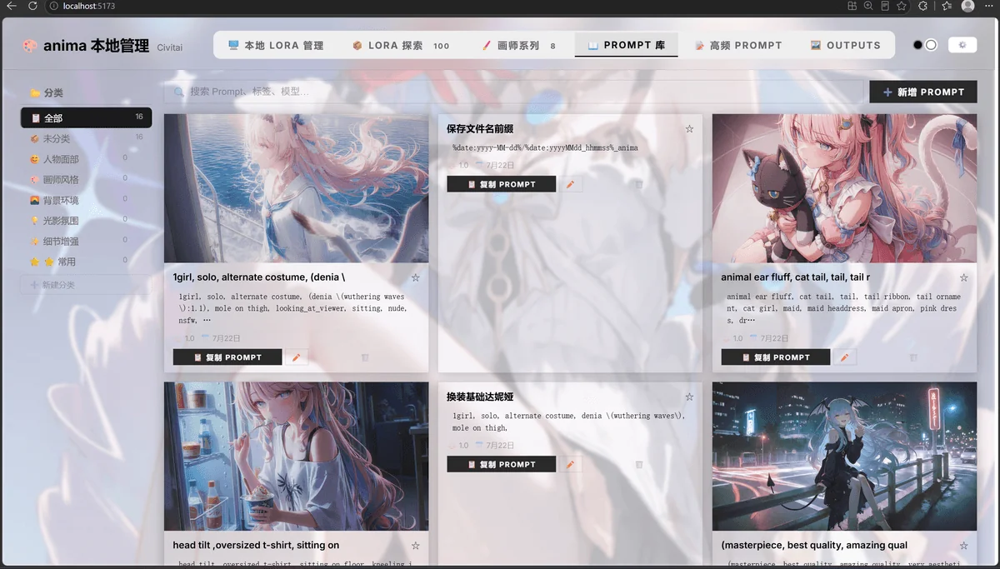

### Outputs 管理

ComfyUI 输出目录浏览，元数据提取，批量操作，可以从图片直接复制正面 prompt、工作流等。复制 lora 功能目前有一些问题（待修复）

可进行拖拽批量选取，通过快捷键进行批量复制下载等操作

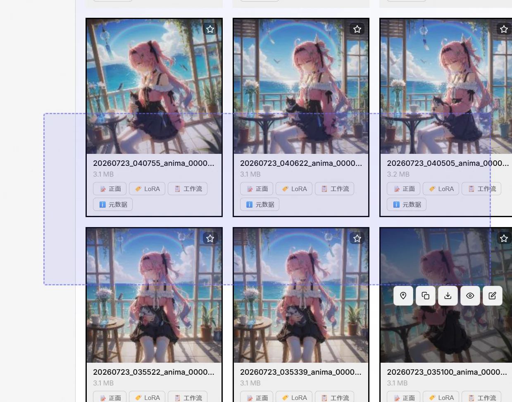

下载功能在选区多个图片时会汇总为压缩包

快捷键

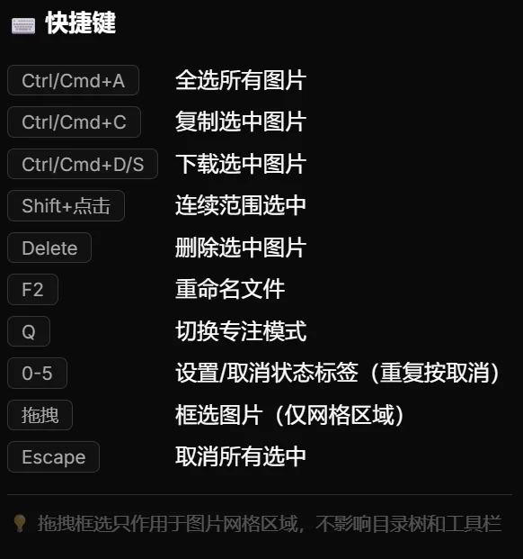

### 图片 Prompt 解析

高频词统计

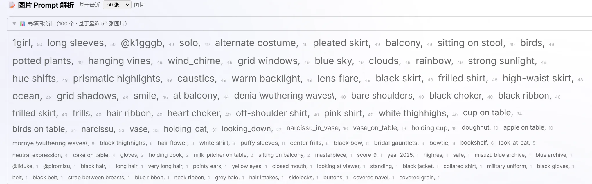

获取元数据

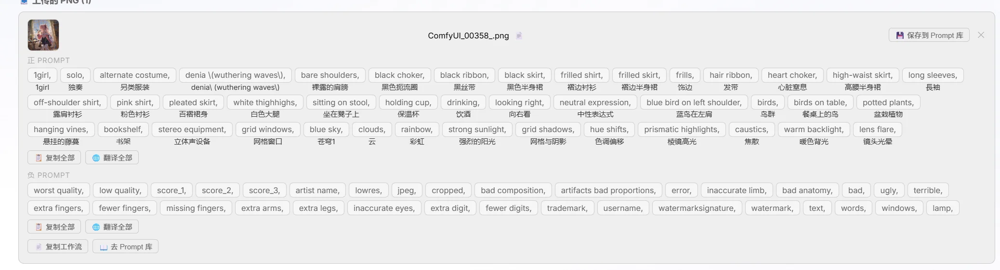

## 🛠️ 从源码重建面板（开发者）

`app/` 是已构建产物，日常使用**无需构建**。修改面板源码后重建：

```bash
cd panel
npm install
npm run build:comfyui   # 类型检查 → vite build → 部署到 ../app
```

- **开发模式**：`cd panel && npm run dev`（Vite 热更新，API 代理到 `http://localhost:8188`）
- **CI 自动构建**：push 到 `panel/` 的改动会由 GitHub Actions 自动重建并提交 `app/`

## 📁 目录结构

```
ComfyUI-Anima-Batch-LoRA/
├── __init__.py           # 后端路由（/anima/* API、元数据持久化）
├── anima_batch_lora.py   # 节点逻辑 + LoRA 列表/桥接 API
├── web/js/               # 节点前端 widget（无需构建）
├── app/                  # 面板构建产物（clone 即用，勿手改）
├── panel/                # 面板源码（Vite + TypeScript）
├── screenshots/          # README 截图
└── .github/workflows/    # 自动构建 app/ 的 CI
```

## 依赖

- ComfyUI（2024 之后版本，含 `folder_paths`、`PromptServer`）
- 面板构建仅需 Node 18+（仅开发 / 重建时需要）

## License

MIT
